# Chat Intelligence Pipeline

## Purpose

This document describes the end-to-end chat intelligence pipeline behind `POST /api/v1/chat/stream`.

The goal is not only to produce correct answers, but to make responses feel:

- adaptive,
- coherent across time,
- emotionally precise,
- paced for the current user state,
- distinctive without becoming manipulative,
- resilient to noisy text, shorthand, and imperfect spelling.

## Pipeline Overview

```mermaid
flowchart TD
    subgraph Transport["Transport Layer"]
        A["POST /api/v1/chat/stream"]
        B["ChatController"]
        A --> B
    end

    subgraph Orchestration["Orchestration — ChatMessageService"]
        C["Load ConversationContext\n(DB: last 30 messages + memories)"]
        D["Persist user message"]
        E["Merge AgentPersona + UserCustomization"]
    end

    subgraph Analysis["Turn Classification"]
        F["HeuristicTurnAnalyzer\n(emotion, energy, need, vulnerability)"]
        G["AIBackedTurnStateInterpreter ⚡IA #1\n(resolved? closing? topic shift?)\n↳ sees last 12 messages"]
    end

    subgraph Planning["Memory & Strategy Planning"]
        H["HeuristicMemoryOrchestrator\n(ReadPlan + WritePlan)\n↳ window: 10–20 messages"]
        I["Relevant retrieval\n(cross-conversation snippets + facts)"]
        J["HeuristicAdaptivePacingPolicy\n(length, tempo, question budget)"]
        K["HeuristicConversationRetentionPlanner\n(mode, opening, closing, relational goal)"]
        L["HeuristicResponsePolicyEngine\n(final mode, length, follow-up override)"]
        M["HeuristicHookEngine\n(ephemeral connection hooks)"]
    end

    subgraph PromptAssembly["Prompt Assembly"]
        N["DefaultChatPromptComposer\n(system prompt from ChatPromptContext)"]
        O["Build aiMessages:\n[system] + history.TakeLast(window) + [user]"]
    end

    subgraph Generation["Generation & Quality Gate"]
        P["IChatAIService ⚡IA #2\n(Gemini / OpenAI / Ollama)\n↳ generates draft response"]
        Q["AIBackedResponseCritic ⚡IA #3\n(validate or rewrite draft)\n↳ sees last 12 messages\n↳ soft mode: no rewrite on low confidence"]
    end

    subgraph Delivery["Delivery"]
        R["Chunk response → SSE stream"]
    end

    subgraph PostTurn["Post-Turn Persistence"]
        S["Persist assistant message"]
        T["Update conversation title + summary"]
        U["Refresh emotional memory"]
        V["Refresh efficacy profile"]
        W["Extract and persist user facts"]
    end

    B --> C --> D --> E
    E --> F --> G
    G --> H --> I
    I --> J --> K --> L --> M
    M --> N --> O
    O --> P --> Q
    Q --> R
    R --> S --> T --> U --> V --> W

    style G fill:#4a9eff,color:#fff
    style P fill:#4a9eff,color:#fff
    style Q fill:#4a9eff,color:#fff
```



## Context Windows (after ADR-0011)

The pipeline was hardened to ensure all AI-backed components share a consistent view of the conversation.

### Database layer

| Parameter                  | Value | Purpose                                   |
| -------------------------- | ----- | ----------------------------------------- |
| `ConversationContextLimit` | 30    | Maximum messages fetched from DB per turn |

### Orchestrator history windows

| Scenario                | Window | Rationale                               |
| ----------------------- | ------ | --------------------------------------- |
| Closing / light closure | 10     | Enough to validate closure is real      |
| Action-oriented         | 12     | Practical context for actionable turns  |
| Default                 | 16     | Standard continuity baseline            |
| Deep / reflective       | 20     | Maximum context for introspective turns |

### AI component context

| Component                      | History                           | Purpose                                        |
| ------------------------------ | --------------------------------- | ---------------------------------------------- |
| `AIBackedTurnStateInterpreter` | 12 messages                       | Classify closure, topic shift, reopen risk     |
| Main LLM generation            | 10–20 messages (via orchestrator) | Generate contextually aware response           |
| `AIBackedResponseCritic`       | 12 messages                       | Validate draft coherence with conversation arc |

### Memory signals always included

| Signal                               | Condition                             |
| ------------------------------------ | ------------------------------------- |
| Conversation summary                 | Always (when conversation exists)     |
| Emotional memory                     | Unless turn is purely action-oriented |
| Efficacy memory                      | Always (when profile exists)          |
| Relevant cross-conversation snippets | Always (limit varies by turn state)   |
| Relevant user facts                  | Always (limit varies by turn state)   |

## Main Components

### `ConversationContext`

Defined in `src/Sery.Application/Chat/IChatPersistence.cs`.

It is the base state for a turn and currently contains:

- `Conversation? Conversation`
- `IReadOnlyList<Message> History`
- `string Language`
- `UserEmotionalMemory? EmotionalMemory`
- `UserChatEfficacyProfile? EfficacyProfile`
- `UserAgentCustomization? AgentCustomization`
- `IReadOnlyList<Message> RelevantHistory`
- `IReadOnlyList<UserMemoryFact> RelevantFacts`

This keeps orchestration independent from EF-specific details.

### `ITurnAnalyzer`

Current implementation: `HeuristicTurnAnalyzer`.

Outputs a typed `TurnAnalysis`:

- `PrimaryEmotion`
- `EmotionalIntensity`
- `EnergyLevel`
- `FormalityLevel`
- `SelfDisclosureDepth`
- `UserNeed`
- `WantsDirectAdvice`
- `WantsReflection`
- `IsQuestionHeavy`
- `ShowsVulnerability`
- `ShowsHumor`
- `ContainsUrgencySignals`

This is the first stage that converts raw text into application-level meaning. It is purely heuristic and does not call the LLM.

### `ITurnStateInterpreter`

Current implementation: `AIBackedTurnStateInterpreter`.

Outputs a `TurnStateInterpretation`:

- `UserSeemsResolved`
- `UserIsClosingConversation`
- `ShouldAvoidReopening`
- `TopicShiftLikely`
- `WantsLightClosure`
- `Confidence`
- `Rationale`

This is **AI call #1** per turn. It sees the last 12 messages and produces a structured JSON classification. If the model fails, it falls back to normalized heuristics.

> **Design constraint (ADR-0011):** The TSI's output is treated as a _hint_, not a hard decision. It no longer gates the conversation summary, and its impact on the history window is bounded (minimum 10 messages even during closure).

### `IMemoryOrchestrator`

Current implementation: `HeuristicMemoryOrchestrator`.

Produces `MemoryOrchestrationResult` with two distinct plans:

- `MemoryReadPlan` — controls what context is loaded into the prompt.
- `MemoryWritePlan` — controls what should be refreshed after the turn.

`MemoryReadPlan` decides:

- how many recent messages to include (10–20),
- whether to include the conversation summary (always yes),
- whether to include emotional memory,
- whether to include efficacy memory,
- whether to include relevant messages and facts,
- what focus instruction to attach to memory usage.

`MemoryWritePlan` decides:

- whether to refresh conversation summary,
- whether to refresh emotional memory,
- whether to refresh efficacy profile,
- whether to capture preference signal,
- why the write decision was made.

### Relevant Retrieval

The pipeline augments the turn with cross-conversation memory:

- `RelevantHistory` — prior user messages from other conversations, ranked by token overlap and recency.
- `RelevantFacts` — persisted `UserMemoryFact` records, ranked similarly.

Current ranking is lexical (normalized token overlap + phrase match boost + recency boost). Semantic embeddings are a planned upgrade.

### `IAdaptivePacingPolicy`

Current implementation: `HeuristicAdaptivePacingPolicy`.

Produces `AdaptivePacingPlan`:

- `PreferredResponseLength`
- `Tempo`
- `BackchannelLevel`
- `QuestionBudget`
- `UseParagraphBreaks`
- `PreferBullets`
- `SentenceStyle`
- `OpeningCadence`
- `ClosingCadence`

### `IConversationRetentionPlanner`

Current implementation: `HeuristicConversationRetentionPlanner`.

Converts turn analysis into a relational posture:

- `ConversationMode` (Warm, Direct, Reflective, Playful, Grounding, Deep, CrisisSafe)
- opening instruction
- relational goal
- tempo instruction
- closing instruction

### `IResponsePolicyEngine`

Current implementation: `HeuristicResponsePolicyEngine`.

Produces `ResponsePolicyDecision`:

- final `ConversationMode`
- final preferred response length
- whether a follow-up question is still allowed
- whether to prefer closure
- whether to avoid reopening
- rationale

This stage is where interpreted turn state can override the initial retention plan.

### `IHookEngine`

Current implementation: `HeuristicHookEngine`.

Adds lightweight, ephemeral prompt hooks such as:

- precise observation
- continuity callback
- inner contrast
- micro next step
- calibrated question
- magnetic phrasing
- soft label

### `IChatPromptComposer`

Current implementation: `DefaultChatPromptComposer`.

Consumes `ChatPromptContext` and assembles the final system prompt. The composer does not perform inference — it only assembles what the planning stages have already decided.

### `IResponseCritic`

Current implementation: `AIBackedResponseCritic`.

This is **AI call #3** per turn. It sees the last 12 messages plus the draft response and evaluates whether the draft:

- reopens a topic the user already closed,
- ignores the latest user message,
- repeats a stale support template,
- sounds melodramatic or disconnected,
- asks a no-longer-relevant follow-up.

> **Design constraint (ADR-0011):** When critic confidence is `"low"`, rewrites are blocked. The sanitized draft is returned instead. This prevents low-context rewrites from destroying contextually correct responses.

### `IConversationInsightsService`

After the assistant response is persisted, this service updates:

- generated conversation title
- compressed conversation summary
- emotional memory summary

### `IChatEfficacyProfiler`

Current implementation: `HeuristicChatEfficacyProfiler`.

Builds a `ChatEfficacyProfileSnapshot` from recent user messages, turn analysis, conversation mode, and pacing plan.

### `IUserFactExtractor`

Current implementation: `HeuristicUserFactExtractor`.

Extracts stable user facts from the current turn (name, preferences, work identity, personal context) and persists them as `UserMemoryFact` records.

## AI Provider Configuration

### Supported providers

| Provider | Class                 | Auth method                    |
| -------- | --------------------- | ------------------------------ |
| Gemini   | `GeminiChatAIService` | `x-goog-api-key` header        |
| OpenAI   | `OpenAIChatAIService` | `Authorization: Bearer` header |
| Ollama   | `OllamaChatAIService` | None (local)                   |

### API key resolution

`ChatAIRequestHelper.ResolveApiKey()` checks in order:

1. `ChatAIOptions.ApiKey` (from appsettings)
2. Environment variable: `GEMINI_API_KEY`, `OPENAI_API_KEY`, or `CHAT_AI_API_KEY`

### Configuration precedence

```
.env (loaded by DotNetEnv) → environment variables → appsettings.Development.json → appsettings.json
```

Environment variables set by `.env` take precedence over appsettings because ASP.NET loads them last.

> **Important:** `HttpClient.BaseAddress` and default headers must be set in the service constructor, not per-call. Setting them inside `GenerateStreamAsync()` causes `InvalidOperationException` on the second call within a scoped DI lifetime (see ADR-0011).

## Persisted Memory Layers

| Layer                     | Scope            | Purpose                                       |
| ------------------------- | ---------------- | --------------------------------------------- |
| `Conversation`            | Per conversation | Title, summary, archive/pin state, timestamps |
| `Message`                 | Per message      | User and assistant message content            |
| `UserEmotionalMemory`     | Per user         | Dominant emotion, emotional summary           |
| `UserChatEfficacyProfile` | Per user         | Preferred mode, length, pacing, strategies    |
| `UserAgentCustomization`  | Per user         | Persona overrides (tone, relationship, style) |
| `UserMemoryFact`          | Per user         | Stable facts (name, preferences, context)     |

## Streaming Tradeoff

The current pipeline critiques the model output before emitting the final SSE chunks. The system no longer forwards raw provider tokens one-by-one.

Current behavior:

1. Provider generates a complete draft.
2. Critic validates or rewrites (soft mode: no rewrite on low confidence).
3. Final answer is chunked and emitted via SSE.

If true token streaming becomes mandatory later, the architecture should move to a dual-path design:

1. Provisional live streaming for low-risk turns.
2. Buffered draft + critic for high-risk or closure-sensitive turns.

## Safety Boundaries

This architecture is intended to increase rapport and continuity, not dependence. The system must not optimize for:

- exclusivity cues,
- romantic framing that overrides support intent,
- coercive emotional escalation,
- pseudo-clinical certainty,
- hidden manipulative tactics.

Safety settings are system-owned and not user-customizable.

## Recommended Next Steps

1. Add explicit telemetry for continuation, reopen failures, and satisfaction.
2. Replace lexical memory scoring with semantic embeddings (Ollama embeddings API or external).
3. Add `UserStyleProfile` so adaptation can rely on learned preference, not only turn-level heuristics.
4. Add moderation-aware overrides for `ConversationMode`, `ResponsePolicyDecision`, and `AdaptivePacingPlan`.
5. Split `IResponseCritic` into fast heuristic pass and optional AI deep review.
6. Introduce dual streaming strategy for low-risk vs closure-sensitive turns.
7. Consider reducing to 2 AI calls per turn by merging TSI into the main LLM call or making it fully heuristic.
